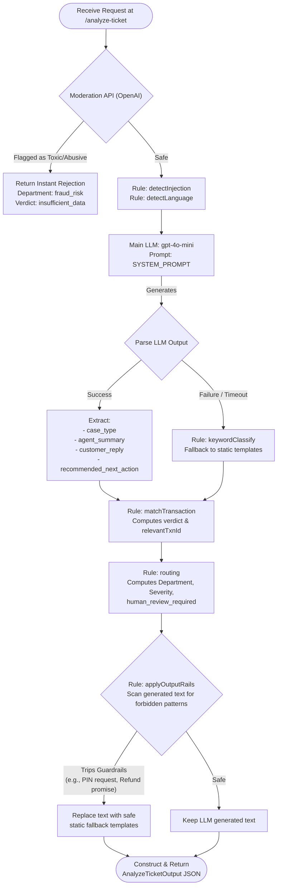
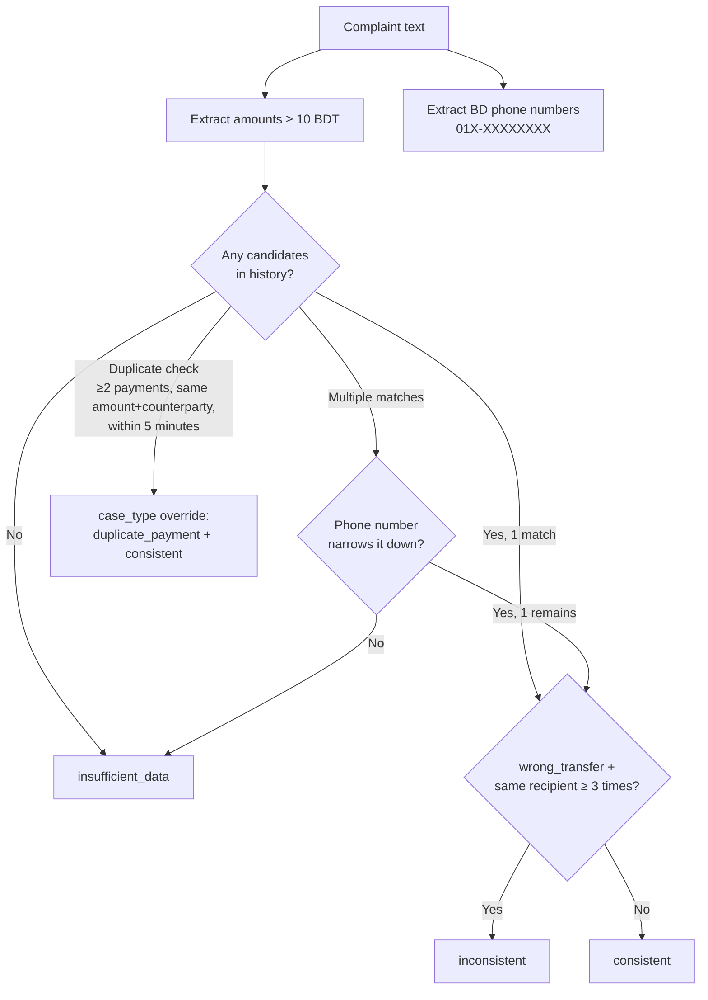

# Support Ticket Analysis API

A backend API that triages digital-finance support tickets, built for platforms like bKash. The core idea is simple: deterministic rules handle everything that can be decided mechanically, and the LLM is only brought in for two things: classifying the case type and drafting the agent summary. Every other field in the response is rule-computed. Even if the LLM is turned off or fails, the service returns a valid 200.

---

## Tech Stack

| Layer | Choice |
|---|---|
| Runtime | [Bun](https://bun.sh/) 1.3+ |
| Framework | [Hono](https://hono.dev/) 4.x |
| Language | TypeScript (strict mode) |
| Validation | [Zod](https://zod.dev/) 4.x |
| LLM | [OpenAI SDK](https://github.com/openai/openai-node) 6.x, one structured-output call |
| Container | Docker + docker-compose |
| Docs | Scalar (`/docs`) + OpenAPI JSON (`/openapi`) |

---

## Setup Instructions

### Prerequisites
- [Bun](https://bun.sh/) ≥ 1.3
- OpenAI API key (only needed if `USE_LLM=true`)

### Install dependencies

```sh
bun install
```

### Configure environment

```sh
cp .env.example .env
# Fill in your OPENAI_API_KEY
```

### Environment Variables

| Variable | Default | Description |
|---|---|---|
| `OPENAI_API_KEY` | N/A | Required when `USE_LLM=true` |
| `OPENAI_MODEL` | `gpt-4o-mini` | Model for the classification call |
| `USE_LLM` | `true` | Set `false` to run keyword-only mode |
| `PORT` | `3000` | Server port |
| `SERVER_URL` | `http://localhost:3000` | Base URL shown in OpenAPI docs |

---

## Run Commands

```sh
# Development (hot reload)
bun run dev

# Production
bun run start

# Docker
docker compose up --build
```

### API Endpoints

| Method | Path | Description |
|---|---|---|
| `POST` | `/analyze-ticket` | Analyze and triage a support ticket |
| `GET` | `/health` | Health check, returns `{"status":"ok"}` |
| `GET` | `/docs` | Interactive API docs (Scalar UI) |
| `GET` | `/openapi` | Raw OpenAPI spec (JSON) |

---

## AI Approach

This service follows a **deterministic-first** design. Rules decide the outcome; the LLM only refines what rules cannot infer reliably from text alone.



### What the rules engine decides (deterministic)
- **Moderation**: Fast API check to instantly reject abuse
- `relevant_transaction_id`: matched from complaint text against transaction history
- `evidence_verdict`: `consistent` / `inconsistent` / `insufficient_data`
- `severity` and `department`: routing table lookup by case type
- `human_review_required`: triggered by escalation flags, inconsistent evidence, or high-value transactions
- **Output Rails**: strictly enforces safe phrases for `customer_reply` and `recommended_next_action`, rewriting them if they violate rules

### What the LLM provides (one structured call)
- `case_type`: locked to 8 allowed values via JSON schema
- `agent_summary`: one or two factual sentences for the support agent
- `customer_reply`: tailored polite reply in the user's language, natively handling ambiguous matches
- `recommended_next_action`: specific, contextual next steps for the agent

The complaint and full transaction history are passed to the LLM to provide maximum context while generating replies. The LLM call has a 10s hard timeout.

### LLM fallback

On any error, timeout, or when `USE_LLM=false`:
- `case_type` → keyword-based classifier
- `agent_summary`, `customer_reply`, `recommended_next_action` → generic safe static templates

The service never crashes or hangs because of the LLM layer. It always returns a valid 200 response.

### Supported case types

| Case Type | Routed To |
|---|---|
| `wrong_transfer` | Dispute Resolution |
| `payment_failed` | Payments Ops |
| `duplicate_payment` | Payments Ops |
| `refund_request` | Customer Support |
| `merchant_settlement_delay` | Merchant Operations |
| `agent_cash_in_issue` | Agent Operations |
| `phishing_or_social_engineering` | Fraud & Risk |
| `other` | Customer Support |

### Transaction matching (deterministic)



---

## Safety Logic

Safety is enforced at both input and output stages. If any output rail trips, the affected field is replaced with a safe deterministic template. The API never returns 5xx because of a guardrail.

### Input rails
1. **Injection neutralization:** Complaint text is untrusted data. It is passed as fenced user content, not in the system prompt. Markers like `ignore previous`, `system:`, `you are now`, and `reply with` are detected and flagged as `possible_injection` in `reason_codes`. Classification still runs normally.
2. **Topical rail:** Off-topic or nonsense complaints are routed to `case_type: other`, `evidence_verdict: insufficient_data`, and `department: customer_support`. The service always returns the full schema.

### Output rails (applied before every response)

| Rail | What It Catches |
|---|---|
| Credential-request scan | Responses asking to share PIN / OTP / password / card |
| Unauthorized-action scan | Promises like "we will refund" or "we will reverse" |
| Third-party redirection | Any reference to unofficial channels |
| Secret/token leak | `sk-` prefixes, stack traces, file paths |
| Injection-echo | Complaint instruction text appearing verbatim in output |
| Schema re-validation | Full Zod check on the final response before sending |

### OpenAI Moderation Guardrail
- Every request is immediately scanned by the OpenAI Moderation API.
- If flagged as toxic, abusive, or violating community guidelines, the ticket is short-circuited.
- It returns a schema-compliant response routing to `fraud_risk` with a `policy_violation_moderation` reason code without ever engaging the main LLM.

---

## Model and Cost Reasoning

**Model:** `gpt-4o-mini` (configurable via `OPENAI_MODEL`)

| Factor | Reasoning |
|---|---|
| Task type | Enum classification (1 of 8 values) plus a 1-2 sentence summary |
| Why mini | Simple classification task; a small fast model is enough and much cheaper |
| Structured output | `strict: true` JSON schema makes invalid enum values impossible at the API level |
| Cost | ~$0.15 per 1M input tokens / ~$0.60 per 1M output tokens, negligible per request |
| Latency | p50 under 1s, within the 5s p95 target |
| Reliability | 10s hard timeout with keyword fallback if the call fails |

---

## Assumptions

| Assumption | Value | Note |
|---|---|---|
| Duplicate detection window | 5 minutes | Two payments with the same amount and counterparty within this window → `duplicate_payment` |
| Minimum amount for matching | 10 BDT | Amounts below this are treated as noise |

---

## Sample Request and Response

### Request

```json
{
  "ticket_id": "TKT-001",
  "complaint": "I sent 5000 taka to the wrong number by mistake.",
  "language": "en",
  "channel": "in_app_chat",
  "user_type": "customer",
  "transaction_history": [
    {
      "transaction_id": "TXN-9821",
      "timestamp": "2024-06-01T10:00:00.000Z",
      "type": "transfer",
      "amount": 5000,
      "counterparty": "01712345678",
      "status": "completed"
    }
  ]
}
```

### Response

```json
{
  "ticket_id": "TKT-001",
  "relevant_transaction_id": "TXN-9821",
  "evidence_verdict": "consistent",
  "case_type": "wrong_transfer",
  "severity": "high",
  "department": "dispute_resolution",
  "agent_summary": "Customer claims a 5000 BDT transfer was sent to the wrong number. Transaction TXN-9821 matches the reported amount.",
  "recommended_next_action": "Verify ledger status for TXN-9821 and initiate dispute resolution process.",
  "customer_reply": "We have noted your concern regarding the transfer of 5000 BDT (Ref: TXN-9821). Our dispute resolution team will review the case and update you through official channels. Please do not share your PIN or OTP with anyone.",
  "human_review_required": true,
  "confidence": 0.9,
  "reason_codes": ["wrong_transfer", "evidence_consistent", "transaction_match", "completed"]
}
```

---

## Project Structure

```
src/
├── index.ts                                   # App entry: mount routes, bind port
├── common/
│   └── schema.ts                              # Shared error response schema
├── modules/
│   ├── analyze-ticket/
│   │   ├── analyze-ticket.schema.ts           # All enums, Zod schemas, and types
│   │   ├── analyze-ticket.route.ts            # HTTP handler: validate → service → respond
│   │   └── analyze-ticket.service.ts          # Thin seam to the investigator agent
│   └── health/
│       ├── health.route.ts
│       ├── health.schema.ts
│       └── health.service.ts
├── agents/
│   ├── investigator.ts                        # Main agent: all reasoning + rail application
│   ├── classifier.ts                          # Keyword fallback classifier
│   ├── routing.ts                             # Routing table, reply builder, next action builder
│   └── rails.ts                               # 6 output guardrail scans
└── utils/
    ├── text.util.ts                           # Amount extraction, phone detection, injection detection
    └── transaction.util.ts                    # Deterministic transaction matching
```
